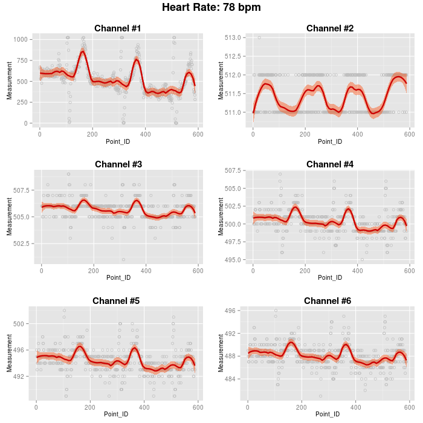

# NAME

ecg.pl

# AUTHOR

Dimitrios - Georgios Kontopoulos
<dgkontopoulos@member.fsf.org>

# DESCRIPTION

This Perl/R script solves the [44th Weekend Programming Challenge by Olimex](http://olimex.wordpress.com/2014/02/21/weekend-prorgamming-challenge-week-44-ecg-heart-beat-detection/).

It reads the ECG-SMT's signal and extracts the measurements for each channel at each time point. It then fits a LOESS model to the first channel's measurements and detects the number of the outlying peaks. Using this number and the hardware specifications, it calculates the heart rate of the individual in beats per minute (bpm). Finally, it also generates LOESS smoothed time series curves of the measurements for each channel.

# RESULT

# DEPENDENCIES

\-the Perl interpreter, >= 5.10

\-Statistics::R, >= 0.32 (Perl module)

\-the R interpreter, >= 3.0.1

\-ggplot2, >= 0.9.3.1 (R package)

\-grid, >= 3.0.1 (R package)
