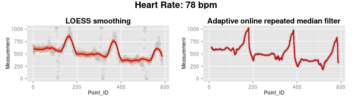

# NAME

ecg.pl

# AUTHOR

Dimitrios - Georgios Kontopoulos
<dgkontopoulos@member.fsf.org>

# DESCRIPTION

This Perl/R script solves the [45th Weekend Programming Challenge by Olimex](http://olimex.wordpress.com/2014/03/07/weekend-programming-challenge-week-45-median-filter/).

It reads the ECG-SMT's signal and extracts the measurements for the 1st channel at each time point. It tries to ignore the noise within the data with two methods:

1. It fits a local regression model to the data.
2. It applies a multivariate adaptive online repeated median filter to the dataset.

Both approaches generate similar looking curves. Using the number of outlying peaks and the hardware specifications, the heart rate of the individual is calculated in beats per minute (bpm). As both noise reduction methods produce curves with the same number of outlying peaks, a common heart rate value is reported. Finally, the script also generates time series curves of the measurements, using both methods.

# RESULT

# DEPENDENCIES

\-the Perl interpreter, >= 5.10

\-Statistics::R, >= 0.32 (Perl module)

\-the R interpreter, >= 3.0.1

\-ggplot2, >= 0.9.3.1 (R package)

\-grid, >= 3.0.1 (R package)

\-robfilter, >= 3.0 (R package)
